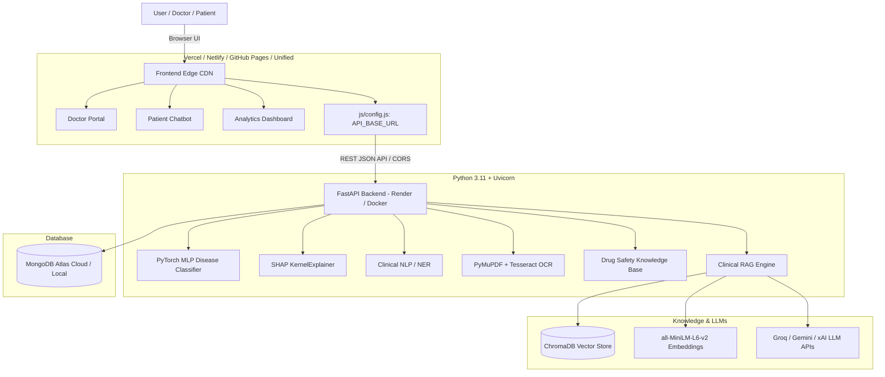

# MEDIRAG-XAI 🏥✨
### Explainable Retrieval-Augmented Clinical Decision Support & Patient Education Platform

[](https://fastapi.tiangolo.com)
[](https://pytorch.org)
[](https://trychroma.com)
[](https://groq.com)
[](https://opensource.org/licenses/MIT)
[]()

> **Production-Ready Healthcare AI Platform** combining Multi-Disease Prediction (PyTorch MLP), Explainable AI (SHAP), Clinical NLP (NER), Automated PDF Lab Report Analysis, Drug Safety & Contraindication Checking, Multi-LLM Clinical RAG, and an Interactive Patient Education Chatbot.

---

## 🌟 Key Capabilities

| Module | Technology | Highlights |
|---|---|---|
| **Multi-Disease Prediction** | PyTorch 4-Layer MLP | 41 Disease classes, 132 symptom features, Top-3 differential predictions with confidence % and ICD-10 codes |
| **Explainable AI (XAI)** | SHAP (KernelExplainer) | Per-patient feature attribution showing positive & negative symptom contributions |
| **Clinical NLP & NER** | SciSpacy / spaCy + Regex | Extracts Diseases, Drugs, Symptoms, Lab values, and Medical history from unstructured clinical notes |
| **PDF & Image Report OCR** | PyMuPDF + Tesseract OCR | Parses 30+ lab parameters (CBC, Thyroid panel, KFT, LFT, Lipid Profile, Diabetes), flags abnormal high/low values with reference ranges |
| **Drug Safety Engine** | Clinical Knowledge Base | Detects drug-drug interactions, FDA pregnancy categories (A-X), allergy alerts, and disease-specific contraindications |
| **Clinical RAG Engine** | ChromaDB + SentenceTransformers | Multi-provider LLM support (Groq, Google Gemini, xAI Grok) with clinical guideline citations (WHO, CDC, ADA) |
| **Doctor & Patient Portals** | Vanilla CSS + Bootstrap 5 + Chart.js | Responsive dark medical UI, interactive symptom grid, real-time SHAP charts, analytics dashboards |

---

## 🏗️ Production Architecture



---

## ⚙️ Environment Variables Reference

Create a `.env` file in the `backend/` directory based on `.env.example`:

| Variable | Required | Default | Description |
|---|---|---|---|
| `LLM_PROVIDER` | No | `groq` | Primary LLM provider (`groq`, `gemini`, `xai`, `none`) |
| `GROQ_API_KEY` | Recommended | `""` | Groq API Key ([console.groq.com](https://console.groq.com)) for ultra-fast free inference |
| `GROQ_MODEL` | No | `qwen/qwen3.8-27b` | Groq model identifier (`qwen/qwen3.8-27b`, `llama-3.3-70b-versatile`) |
| `GEMINI_API_KEY` | Optional | `""` | Google Gemini API Key ([aistudio.google.com](https://aistudio.google.com)) |
| `GEMINI_MODEL` | No | `gemini-2.5-flash` | Gemini model identifier |
| `XAI_API_KEY` | Optional | `""` | xAI Grok API Key ([console.x.ai](https://console.x.ai)) |
| `XAI_MODEL` | No | `grok-2` | xAI model identifier |
| `MONGODB_URI` | No | `mongodb://localhost:27017` | MongoDB connection URI (MongoDB Atlas or local) |
| `PORT` | No | `8000` | Port for the FastAPI server (Render/Railway set this automatically) |
| `HOST` | No | `0.0.0.0` | Host IP for FastAPI server |
| `CORS_ORIGINS` | No | `*` | Allowed CORS origins (comma-separated, e.g. `https://my-app.vercel.app`) |

---

## 💻 Local Development Setup

### 1. Clone & Activate Virtual Environment
```bash
git clone https://github.com/daxgandhi/MediRAG-XAI.git
cd MediRAG-XAI

# Create virtual environment
python -m venv .venv

# Activate environment:
# Windows (PowerShell):
.venv\Scripts\activate
# Linux/macOS:
source .venv/bin/activate
```

### 2. Install Dependencies
```bash
cd backend
pip install -r requirements.txt
python -m spacy download en_core_web_sm
```

### 3. Configure `.env`
```bash
cp .env.example .env
# Edit .env and insert your API keys
```

### 4. Run the Backend & Access App
```bash
# Model will automatically train if weights are missing, or train manually:
python train_model.py

# Start server:
python main.py
```

* **Landing Page**: [http://localhost:8000/](http://localhost:8000/)
* **Doctor Portal**: [http://localhost:8000/doctor.html](http://localhost:8000/doctor.html)
* **Patient Chatbot**: [http://localhost:8000/patient.html](http://localhost:8000/patient.html)
* **Analytics Dashboard**: [http://localhost:8000/analytics.html](http://localhost:8000/analytics.html)
* **Interactive API Docs (Swagger)**: [http://localhost:8000/docs](http://localhost:8000/docs)

---

## 🌐 Production Deployment Guide

You can deploy MediRAG-XAI in two modes:

### Option A: Unified Full-Stack (Render - Free)
Deploys both frontend and backend together on Render using the included [`render.yaml`](file:///c:/Users/asus/Desktop/New%20folder%20(3)/MediRAG-XAI/render.yaml) or Dockerfile:

1. Push your code to GitHub.
2. Log into [Render.com](https://render.com) $\rightarrow$ **New +** $\rightarrow$ **Web Service**.
3. Select your repository. Render will automatically detect the configuration.
4. Set your environment variables in the Render dashboard (`GROQ_API_KEY`, `GEMINI_API_KEY`, `MONGODB_URI`).
5. Click **Deploy Web Service**.

---

### Option B: Decoupled Deployment (Lowest Server CPU & RAM)
Hosting the static frontend on a Global Edge CDN (Vercel / Netlify / GitHub Pages) offloads 100% of static asset serving from your backend:

#### 1. Deploy Backend (API Server)
* Deploy the backend on **Render**, **Railway**, or **Koyeb**.
* Copy the deployed backend URL (e.g. `https://medirag-backend.onrender.com`).
* Set `CORS_ORIGINS` in your backend environment to your frontend domain (or `*`).

#### 2. Configure & Deploy Frontend
* In [`frontend/js/config.js`](file:///c:/Users/asus/Desktop/New%20folder%20(3)/MediRAG-XAI/frontend/js/config.js), set your backend API URL:
  ```javascript
  const MEDIRAG_CONFIG = {
    API_BASE_URL: 'https://medirag-backend.onrender.com'
  };
  ```
  *(Alternatively, you can leave it as `""` and set it dynamically in the browser console via `localStorage.setItem('MEDIRAG_API_URL', 'https://medirag-backend.onrender.com')`)*
* Deploy the `frontend/` folder to **Vercel** (Import repository $\rightarrow$ set Root Directory to `frontend`) or **GitHub Pages**.

---

## 🐳 Docker Container Deployment

The multi-stage [`Dockerfile`](file:///c:/Users/asus/Desktop/New%20folder%20(3)/MediRAG-XAI/Dockerfile) includes Python 3.11, PyTorch, and Tesseract OCR:

```bash
# Build the Docker image
docker build -t medirag-xai .

# Run container with environment variables
docker run -d -p 8000:8000 --env-file backend/.env --name medirag-app medirag-xai
```

---

## 🧪 Testing Suite

Run the full automated test suite (37 unit & integration tests covering classifier, SHAP, NER, drug checker, report extraction, and API routes):

```bash
pytest backend/tests/test_medirag.py -v
```

---

## 📌 Free Hosting Considerations & Vector Storage Architecture

### 1. Cold Starts on Free Tiers
* **Render Free Web Services** spin down after 15 minutes of inactivity. The first request after sleep may take ~30-45 seconds to spin up.
* **Keep-Alive Tip**: Use a free monitoring service like [UptimeRobot](https://uptimerobot.com) to ping your `/health` endpoint every 5 minutes to prevent sleep.

### 2. ChromaDB Vector Store & Container Lifecycle
* **Local / Ephemeral Storage**: On container platforms (like Render without a paid persistent disk), local files written during container runtime reset on redeployment.
* **Self-Healing Indexing**: `RAGEngine` automatically checks if vectors exist. If missing on startup, it automatically re-indexes all guidelines in `backend/data/guidelines` in ~2-4 seconds.
* **Enterprise Scaling**: For large-scale production, connect to a hosted managed vector database (such as **Pinecone**, **Qdrant Cloud**, or **Chroma Cloud**) or attach a persistent block storage volume.

### 3. Model Training Lifecycle
* PyTorch MLP model training (`train_model.py`) trains on 4,920 records for 50 epochs in **< 5 seconds** on standard CPU.
* The application is self-healing: if model weights are missing on fresh checkout/deployment, `DiseaseClassifier` automatically trains lightweight weights on first initialization to ensure zero downtime.

---

## ⚠️ Clinical & Academic Disclaimer

**IMPORTANT NOTICE**: This application is developed for **academic research, educational demonstrations, and clinical decision support prototyping**. It does NOT constitute medical advice, diagnosis, or treatment. Always seek the advice of a physician or qualified healthcare provider with any questions regarding medical conditions.

---

## 📄 License

Distributed under the **MIT License**.
