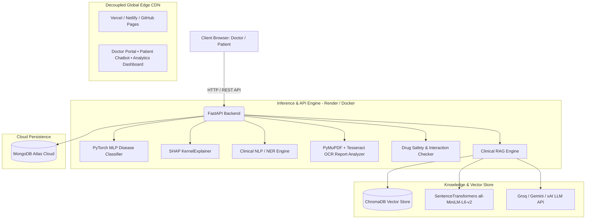

# MEDIRAG-XAI 🏥✨
### Explainable Retrieval-Augmented Clinical Decision Support and Patient Education Platform

[](https://fastapi.tiangolo.com)
[](https://pytorch.org)
[](https://trychroma.com)
[](https://groq.com)
[](https://opensource.org/licenses/MIT)
[]()

> **Production-Ready Healthcare AI Platform** combining Multi-Disease Prediction (PyTorch MLP), Explainable AI (SHAP), Clinical NLP (NER), Automated PDF Lab Report Analysis, Drug Safety & Contraindication Checking, Multi-LLM Clinical RAG, and an Interactive Patient Education Chatbot.

---

## 🌟 Key Features

| Module | Technology | Highlights |
|---|---|---|
| **Multi-Disease Prediction** | PyTorch 4-Layer MLP | 41 Disease classes, 132 symptom features, Top-3 differential predictions with confidence % and ICD-10 codes |
| **Explainable AI (XAI)** | SHAP (KernelExplainer) | Per-patient feature attribution showing positive & negative symptom contributions |
| **Clinical NLP & NER** | SciSpacy / spaCy + Regex | Extracts Diseases, Drugs, Symptoms, Lab values, and Medical history from unstructured clinical notes |
| **PDF & Image Report OCR** | PyMuPDF + Tesseract OCR | Parses 30+ lab values (CBC, Thyroid panel, KFT, LFT, Lipid Profile, Diabetes), flags abnormal high/low values with reference ranges |
| **Drug Safety Engine** | Clinical Knowledge Base | Detects drug-drug interactions, FDA pregnancy categories (A-X), allergy alerts, and disease-specific contraindications |
| **Clinical RAG Engine** | ChromaDB + SentenceTransformers | Multi-provider LLM support (Groq, Google Gemini, xAI Grok) with clinical guideline citations (WHO, CDC, ADA) |
| **Doctor & Patient Portals** | Vanilla CSS + Bootstrap 5 + Chart.js | Responsive dark medical UI, interactive symptom grid, real-time SHAP charts, analytics dashboards |

---

## 🏗️ Architecture & Dataflow



---

## 📊 Dataset Specifications

* **Source**: [Kaggle — Disease Prediction Using Machine Learning](https://www.kaggle.com/datasets/kaushil268/disease-prediction-using-machine-learning)
* **Training Records**: 4,920 samples
* **Testing Records**: 42 validation cases
* **Features**: 132 binary symptom indicators
* **Target Classes**: 41 distinct medical conditions
* **Model Validation Accuracy**: **97.56%**

---

## 📁 Repository Structure

```
MediRAG-XAI/
├── backend/
│   ├── main.py                  # Uvicorn FastAPI server entry point
│   ├── app.py                   # REST API routes, middleware, static mount
│   ├── train_model.py           # PyTorch MLP training pipeline
│   ├── requirements.txt         # Production Python dependencies
│   ├── .env                     # Environment configuration (secrets)
│   ├── model/
│   │   ├── classifier.py        # PyTorch Neural Network model & inference
│   │   ├── shap_explainer.py    # SHAP feature importance interpreter
│   │   ├── ner.py               # Clinical named entity recognition
│   │   ├── report_analyzer.py   # PDF text extraction & OCR lab value parser
│   │   ├── drug_checker.py      # Drug interaction & contraindication engine
│   │   └── rag_engine.py        # ChromaDB vector retrieval & LLM generation
│   ├── saved_models/            # Trained weights (.pth), metadata, encoder
│   ├── data/
│   │   ├── datasets/            # Training.csv, Testing.csv, Symptom mappings
│   │   ├── guidelines/          # Clinical guidelines (Diabetes, Hypertension, TB, etc.)
│   │   └── patient_docs/        # Patient educational materials
│   ├── database/
│   │   └── mongodb.py           # Async MongoDB driver (Motor) with fallback
│   └── tests/
│       └── test_medirag.py      # Full 37-test automated test suite
├── frontend/
│   ├── index.html               # Landing & product page
│   ├── doctor.html              # Clinical Doctor Decision Portal
│   ├── patient.html             # Patient AI Assistant & Education Chatbot
│   ├── analytics.html           # Real-time clinical analytics dashboard
│   ├── css/style.css            # Dark glassmorphic medical theme
│   └── js/
│       ├── app.js               # Dynamic API client & shared utilities
│       ├── doctor.js            # Doctor portal interactions & SHAP charts
│       ├── patient.js           # Streaming chat & citation renderer
│       └── analytics.js         # Chart.js analytics visualizations
├── vector_db/                   # ChromaDB persistent vector storage
├── Dockerfile                   # Multi-stage production container with Tesseract
├── .dockerignore                # Exclusions for clean container builds
├── render.yaml                  # One-click Render cloud deployment blueprint
├── setup.bat                    # One-click Windows setup script
└── README.md
```

---

## ⚡ Quick Start (Local Setup)

### Prerequisites
* Python 3.10 or 3.11
* Git
* (Optional) Tesseract OCR for image-based lab report parsing

### 1. Clone & Setup Virtual Environment
```bash
git clone https://github.com/daxgandhi/MediRAG-XAI.git
cd MediRAG-XAI

# Create and activate virtual environment
python -m venv .venv

# Windows:
.venv\Scripts\activate
# Linux/macOS:
source .venv/bin/activate
```

### 2. Install Dependencies & NLP Models
```bash
cd backend
pip install -r requirements.txt
python -m spacy download en_core_web_sm
```

### 3. Configure `.env`
Create or edit `backend/.env`:
```env
LLM_PROVIDER=groq
GROQ_API_KEY=your_groq_api_key_here
GROQ_MODEL=qwen/qwen3.8-27b

GEMINI_API_KEY=your_gemini_api_key_here
GEMINI_MODEL=gemini-2.5-flash

MONGODB_URI=mongodb://localhost:27017
```
*(Get free Groq API keys at [console.groq.com](https://console.groq.com) and Gemini keys at [aistudio.google.com](https://aistudio.google.com))*

### 4. Train Model & Launch Server
```bash
# Train the PyTorch model
python train_model.py

# Launch FastAPI backend
python main.py
```

* **Main App**: [http://localhost:8000](http://localhost:8000)
* **Doctor Portal**: [http://localhost:8000/doctor.html](http://localhost:8000/doctor.html)
* **Patient Chatbot**: [http://localhost:8000/patient.html](http://localhost:8000/patient.html)
* **Analytics Dashboard**: [http://localhost:8000/analytics.html](http://localhost:8000/analytics.html)
* **Interactive API Docs (Swagger)**: [http://localhost:8000/docs](http://localhost:8000/docs)

---

## 🚀 100% Free Production Deployment

### Option A: Unified Deployment (Render - Free)
1. Fork or push this repository to your GitHub account.
2. Sign up on [Render.com](https://render.com).
3. Click **New +** $\rightarrow$ **Web Service** $\rightarrow$ Connect `MediRAG-XAI`.
4. Render will detect [`render.yaml`](file:///c:/Users/asus/Desktop/New%20folder%20(3)/MediRAG-XAI/render.yaml) and the [`Dockerfile`](file:///c:/Users/asus/Desktop/New%20folder%20(3)/MediRAG-XAI/Dockerfile).
5. Set your secret environment variables (`GROQ_API_KEY`, `GEMINI_API_KEY`, `MONGODB_URI`).
6. Click **Deploy Web Service**.

### Option B: Decoupled High-Performance Deployment (Recommended)
To minimize backend CPU and RAM usage to near zero:
1. **Deploy Backend API** on [Render](https://render.com) or [Koyeb](https://www.koyeb.com).
2. **Deploy Frontend** on [Vercel](https://vercel.com) (Import repo $\rightarrow$ Set Root Directory to `frontend` $\rightarrow$ Deploy) or **GitHub Pages**.
3. The frontend automatically discovers and communicates with your backend API.

---

## 🐳 Docker Deployment

Run the complete platform inside a self-contained container:

```bash
# Build the Docker image
docker build -t medirag-xai .

# Run container
docker run -d -p 8000:8000 --env-file backend/.env --name medirag-app medirag-xai
```

---

## 🧪 Testing Suite

Run the automated test suite (37 unit & integration tests covering classifier, SHAP, NER, drug checker, report extraction, and API routes):

```bash
pytest backend/tests/test_medirag.py -v
```

---

## 🔌 API Reference

| Endpoint | Method | Description | Payload Example |
|---|---|---|---|
| `/health` | `GET` | Health status and module availability | — |
| `/api/predict` | `POST` | Disease prediction with SHAP explanations | `{"symptoms": ["itching", "skin_rash"], "patient_age": 30}` |
| `/api/ner` | `POST` | Clinical entity extraction from raw text | `{"text": "Patient has diabetes, prescribed Metformin 500mg"}` |
| `/api/analyze-report` | `POST` | PDF & OCR lab value extraction & normal ranges | `multipart/form-data (file: report.pdf)` |
| `/api/check-drug` | `POST` | Drug interaction, allergy, & pregnancy safety | `{"drug_name": "lisinopril", "is_pregnant": true}` |
| `/api/chat` | `POST` | RAG-powered clinical chatbot with citations | `{"message": "What are normal HbA1c ranges?", "session_id": "doc1"}` |
| `/api/analytics` | `GET` | Aggregated disease & clinical statistics | — |

---

## ⚠️ Medical Disclaimer

**IMPORTANT NOTICE**: This platform is designed as an **educational and decision-support prototype**. It does not constitute formal medical diagnosis, clinical prescription, or personalized medical advice. Always consult a licensed healthcare practitioner for medical diagnosis and treatment.

---

## 📄 License

Distributed under the **MIT License**. See `LICENSE` for more information.
